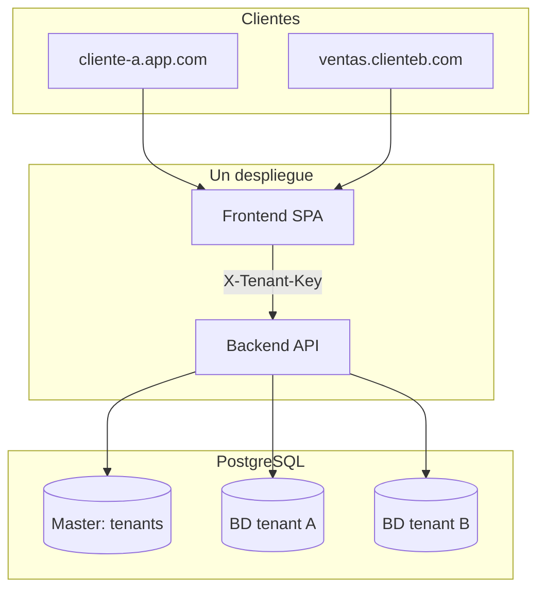

# Arquitectura tecnica

## Vista general

El sistema se compone de cuatro bloques:

1. **Frontend web** (`frontend/`): UI operativa para agentes/supervisores/admin.
2. **Backend API** (`backend/`): dominio de negocio, persistencia, seguridad y realtime.
3. **Telefonia Asterisk** (`deploy/asterisk/`): PBX SIP/WebRTC/ARI para voz.
4. **Automatizacion de despliegue** (`deploy/azure/`): scripts para provision y deploy.
5. **Guia de onboarding** (`docs/08-manual-configuracion-cliente-nuevo.md`): configuracion completa de un cliente nuevo desde cero.

## Stack implementado

### Frontend

- React + TypeScript.
- Router de paginas y modulos operativos.
- Hook de softphone SIP/WebRTC.

### Backend

- Node.js + Express.
- Prisma ORM (PostgreSQL).
- Redis + BullMQ para colas y workers.
- Socket.IO para eventos en tiempo real.
- Zod para validacion de entorno.

### Infraestructura de datos

- **PostgreSQL Master** (`prisma/master.schema.prisma`): tabla `tenants` con dominios y credenciales de cada empresa.
- **PostgreSQL por tenant**: una BD independiente por empresa; esquema de negocio identico en todas (sin columna `TenantId`).
- Redis para encolamiento y procesamiento distribuido (claves y salas Socket.IO prefijadas por `tenantKey`).
- Prisma dual: `@prisma/client` (negocio) + `@prisma/client-master` (registro).

## Multi-tenant (database-per-tenant)

Componentes backend:

| Modulo | Ruta | Funcion |
|---|---|---|
| Contexto ALS | `src/lib/tenantContext.ts` | `getCurrentTenantKey()`, `runWithTenant()` |
| Connection Manager | `src/lib/tenantConnectionManager.ts` | Pool Prisma por `tenantKey`, `resolveByHost()` |
| Master client | `src/lib/masterPrisma.ts` | Acceso solo a tabla `tenants` |
| Tenant middleware | `src/middleware/tenant.ts` | Exige `X-Tenant-Key`; excepciones: `/health`, `/tenants/resolve`, webhook con `:tenantKey` en path |
| Acceso negocio | `src/lib/prisma.ts` | `getPrisma()` — requiere contexto de tenant activo |

Reglas clave:

- Login **sin selector de empresa**: el tenant se resuelve por hostname (prod) o `VITE_TENANT_KEY` (dev).
- JWT incluye `tenantKey` y debe coincidir con el header en cada request autenticado.
- Migraciones de negocio se aplican en **cada BD tenant** via `npm run migrate:all-tenants`.
- Alta de tenant nuevo: panel `/platform/tenants` o API `/api/platform/tenants`.

Referencia completa: [ESTANDAR_ARQUITECTURA_MULTITENANT.md](./ESTANDAR_ARQUITECTURA_MULTITENANT.md).

## Capas backend

### 1) Transporte/API

- `backend/src/app.ts`: middlewares globales (`helmet`, `cors`, `json`, `urlencoded`).
- `backend/src/server.ts`: servidor HTTP + Socket.IO + workers opcionales.
- `backend/src/routes/api.ts`: exposicion de endpoints REST.

### 2) Dominio y casos de uso

- `backend/src/services/*`: logica funcional (auth, contactos, conversaciones, reportes, calidad, integraciones, voz).
- `backend/src/routing/RoutingEngine.ts`: recomendacion y asignacion por estrategia.

### 3) Integraciones de canal

- `backend/src/channels/*`: adapters por tipo de canal.
- `backend/src/channels/registry.ts`: fabrica de adapters.
- Validadores de configuracion por canal (`voice/config.ts`, `email/config.ts`, `whatsapp/config.ts`).

### 4) Persistencia e infraestructura

- `backend/prisma/schema.prisma`: esquema de negocio (por BD tenant).
- `backend/prisma/master.schema.prisma`: esquema Master (solo `tenants`).
- `backend/src/lib/prisma.ts`: `getPrisma()` acotado al tenant del request.
- `backend/src/lib/tenantConnectionManager.ts`: pools dinamicos por tenant.
- `backend/src/lib/redis.ts` y `backend/src/queue/bull.ts`: cola y jobs (payload incluye `tenantKey`).

## Tiempo real

- El servidor inicializa Socket.IO en el mismo proceso del API.
- Se emiten eventos operativos (ej. asignaciones, mensajes nuevos, estado de agente).
- Las salas por usuario/cola conversacion facilitan actualizacion selectiva de UI.

## Seguridad y control

- Resolucion de tenant por `X-Tenant-Key` (header) o `:tenantKey` en path de webhooks.
- Autenticacion JWT + refresh token; payload incluye `tenantKey` validado contra header.
- Middleware de autenticacion para rutas privadas.
- Middleware de permisos por capacidad (`requirePermission`, `requireAnyPermission`).
- API key separada para integraciones machine-to-machine.
- Rate limit aplicado al router principal.

## Topologia funcional de datos

1. Ingreso (webhook, integracion o UI).
2. Normalizacion por servicio de dominio.
3. Persistencia en PostgreSQL.
4. Encolamiento (cuando aplica).
5. Emision de eventos realtime.
6. Consumo por frontend y paneles operativos.

## Componentes de voz

- Asterisk expone:
  - SIP UDP para extensiones no web.
  - WSS para softphone del navegador.
  - ARI para integracion con asistente de IA.
- Dialplan interno para interconexion de `1000`, `6001`, `7001`, `8001`.

## Decisiones clave actuales

- Historico de llamadas desacoplado de conversaciones (`voice_calls`).
- Logging de queries Prisma controlable por entorno (`PRISMA_LOG_QUERIES`).
- Soporte mixto SIP UDP y WebRTC para coexistencia entre web y softphone movil/desktop.
